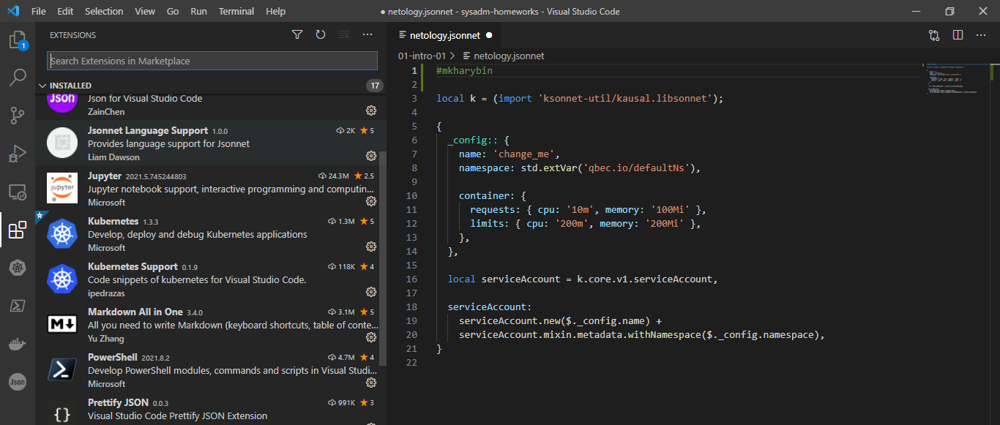

## Задание №1 - Подготовка рабочей среды

- Terraform: 
- Bash: 
- Markdown: 
- Yaml: 
- Jsonnet: 

## Задание №2 - Описание жизненного цикла задачи (разработки нового функционала)

1. Постановка задачи, сбор и анализ требований (заказчик, бизнес-аналитик/менеджер)
2. Выбор дизайна решения и формирование технического задания (техконсультант, программист, девопс, заказчик)
3. Написание кода (программист), написание документации (техпис)
4. Сборка и выкатка приложения в dev и prod среду (девопс), разработка плана деплоев (девопс, техпис)
5. Тестирование (тестировщик)
6. Деплой в uat (девопс)
7. Тестирование конечным пользователем/заказчиком (заказчик, менеджер)
8. Принятие решения о выкатке приложения в prod среду (заказчик, менеджер)
9. Деплой приложения в prod среду (девопс)
10. Мониторинг, выявление багов, обслуживание, обновление приложения (девопс, саппорт, программист)
11. Вывод из эксплуатации (девопс)
