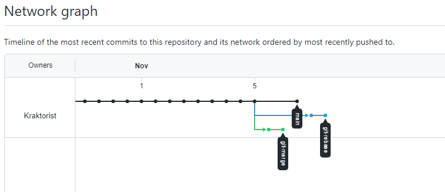
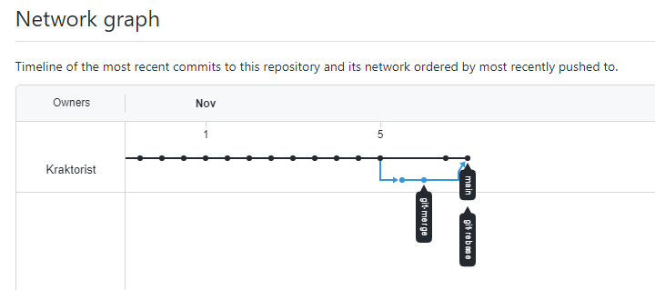

### Before merging and rebasing


### After merging and rebasing


```
PS C:\Users\user\repos\do> git log --decorate --graph  --pretty=format:"%d %h - %an, %ai : %s"
*    (HEAD -> main, remote/main, remote/git-rebase, remote/HEAD, git-rebase) e674d77 - Mikhail Kharybin, 2021-11-05 14:34:45 +0300 : Merge branch 'git-merge' into main
|\
| *  (remote/git-merge, git-merge) 63d8cce - Mikhail Kharybin, 2021-11-05 14:24:36 +0300 : merge: use shift
| *  413d0d1 - Mikhail Kharybin, 2021-11-05 14:24:02 +0300 : merge: @ instead *
* |  9d9400e - Mikhail Kharybin, 2021-11-05 14:26:18 +0300 : changing rebase.sh
|/
*  41c3a7a - Mikhail Kharybin, 2021-11-05 14:21:59 +0300 : prepare for merge and rebase
*  fccc455 - Kraktorist, 2021-11-01 20:51:01 +0300 : Update README.md
*  2cb5654 - Kraktorist, 2021-11-01 20:50:00 +0300 : Update README.md
*  dd3a00e - Mikhail Kharybin, 2021-11-01 20:45:04 +0300 : Moved and deleted
*  16c1830 - Mikhail Kharybin, 2021-11-01 20:43:28 +0300 : Prepare to delete and move
...
```