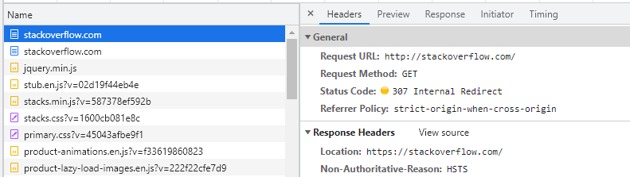
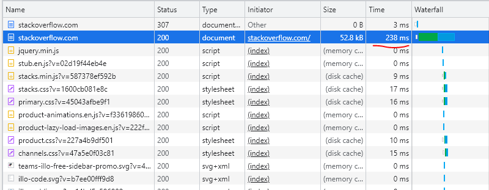

# Домашнее задание к занятию "3.6. Компьютерные сети, лекция 1"

1. Работа c HTTP через телнет.
- Подключитесь утилитой телнет к сайту stackoverflow.com
`telnet stackoverflow.com 80`  
- отправьте HTTP запрос
```bash
GET /questions HTTP/1.0
HOST: stackoverflow.com
[press enter]
[press enter]
```
- В ответе укажите полученный HTTP код, что он означает?  
**Answer**  

        HTTP/1.1 301 Moved Permanently
        cache-control: no-cache, no-store, must-revalidate
        location: https://stackoverflow.com/questions

        (rfc3271) The 301 (Moved Permanently) status code indicates that the target resource has been assigned a new permanent URI and any future references to this resource ought to use one of the enclosed URIs.

2. Повторите задание 1 в браузере, используя консоль разработчика F12.
- откройте вкладку `Network`
- отправьте запрос http://stackoverflow.com
- найдите первый ответ HTTP сервера, откройте вкладку `Headers`
- укажите в ответе полученный HTTP код.  
- проверьте время загрузки страницы, какой запрос обрабатывался дольше всего?  
- приложите скриншот консоли браузера в ответ.  
  **Answer**  



3. Какой IP адрес у вас в интернете?  
**Answer**

        vagrant@vagrant:~$ curl https://ipinfo.io/ip
        31.178.85.251

4. Какому провайдеру принадлежит ваш IP адрес? Какой автономной системе AS? Воспользуйтесь утилитой `whois`  
**Answer**

        vagrant@vagrant:~$ whois 31.173.85.251 | grep -E "descr|origin"
        descr:          Metropolitan branch of OJSC MegaFon AS25159 31.173.80.0/21
        descr:          MegaFon-Moscow
        origin:         AS25159


5. Через какие сети проходит пакет, отправленный с вашего компьютера на адрес 8.8.8.8? Через какие AS? Воспользуйтесь утилитой `traceroute`  
**Answer**

        vagrant@vagrant:~$ traceroute -nA 8.8.8.8
        traceroute to 8.8.8.8 (8.8.8.8), 30 hops max, 60 byte packets
        1  10.0.2.2 [*]  0.520 ms  0.425 ms  0.368 ms
        2  192.168.0.1 [*]  1.401 ms  1.532 ms  1.563 ms
        3  10.12.84.1 [*]  4.499 ms  4.933 ms  5.040 ms
        4  10.15.0.97 [*]  4.691 ms  4.660 ms  4.733 ms
        5  46.151.158.234 [AS50473]  5.374 ms  6.416 ms  6.337 ms
        6  193.105.59.216 [AS50473]  4.750 ms  2.239 ms  2.389 ms
        7  46.151.158.242 [AS50473]  2.431 ms  3.748 ms  3.856 ms
        8  * * *
        9  108.170.227.74 [AS15169]  3.883 ms 72.14.233.90 [AS15169]  3.834 ms 108.170.250.33 [AS15169]  3.999 ms
        10  108.170.250.146 [AS15169]  13.594 ms 108.170.250.99 [AS15169]  4.168 ms *
        11  142.251.49.24 [AS15169]  18.290 ms 209.85.255.136 [AS15169]  21.153 ms *
        12  216.239.48.224 [AS15169]  26.517 ms 172.253.66.110 [AS15169]  19.941 ms 72.14.238.168 [AS15169]  19.040 ms
        13  142.250.210.47 [AS15169]  20.640 ms 172.253.70.47 [AS15169]  15.620 ms 172.253.51.241 [AS15169]  17.366 ms
        14  * * *
        15  * * *
        16  * * *
        17  * * *
        18  * * *
        19  * * *
        20  * * *
        21  * * 8.8.8.8 [AS15169]  17.035 ms


6. Повторите задание 5 в утилите `mtr`. На каком участке наибольшая задержка - delay?  
**Answer**

        vagrant@vagrant:~$ mtr -znlro A 8.8.8.8
        Start: 2021-12-03T17:05:09+0000
        HOST: vagrant                       Avg
        1. AS???    10.0.2.2              0.5
        2. AS???    192.168.0.1           1.1
        3. AS???    10.12.84.1           25.1
        4. AS???    10.15.0.97            5.2
        5. AS50473  46.151.158.234        3.6
        6. AS50473  193.105.59.216        2.1
        7. AS50473  46.151.158.242        2.3
        8. AS15169  142.251.64.109        1.8
        9. AS15169  108.170.250.83        2.1
        10. AS15169  142.251.71.194       30.4
        11. AS15169  172.253.66.110       17.6
        12. AS15169  172.253.79.113       16.9
        13. AS???    ???                   0.0
        14. AS???    ???                   0.0
        15. AS???    ???                   0.0
        16. AS???    ???                   0.0
        17. AS???    ???                   0.0
        18. AS???    ???                   0.0
        19. AS???    ???                   0.0
        20. AS???    ???                   0.0
        21. AS???    ???                   0.0
        22. AS15169  8.8.8.8              14.5

7. Какие DNS сервера отвечают за доменное имя dns.google? Какие A записи? воспользуйтесь утилитой `dig`  
**Answer**

        vagrant@vagrant:~$ dig +noall +answer dns.google
        dns.google.             461     IN      A       8.8.4.4
        dns.google.             461     IN      A       8.8.8.8


8. Проверьте PTR записи для IP адресов из задания 7. Какое доменное имя привязано к IP? воспользуйтесь утилитой `dig`  
**Answer**

        vagrant@vagrant:~$ dig +short -x 8.8.4.4 PTR
        dns.google.
        vagrant@vagrant:~$ dig +short -x 8.8.8.8 PTR
        dns.google.
