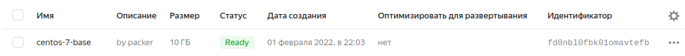
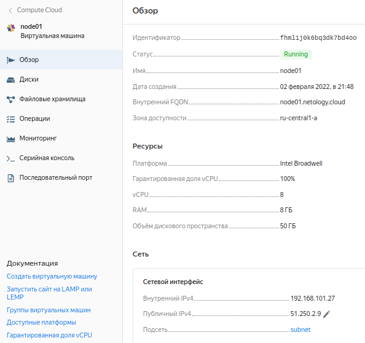

# Домашнее задание к занятию "5.4. Оркестрация группой Docker контейнеров на примере Docker Compose"

## Задача 1

Создать собственный образ операционной системы с помощью Packer.

Для получения зачета, вам необходимо предоставить:
- Скриншот страницы, как на слайде из презентации (слайд 37).  

**Answer**

    root@hmlab01:~/# yc compute image list
    +----------------------+---------------+--------+----------------------+--------+
    |          ID          |     NAME      | FAMILY |     PRODUCT IDS      | STATUS |
    +----------------------+---------------+--------+----------------------+--------+
    | fd8nbl0fbk01omavtefb | centos-7-base | centos | f2eacrudv331nbat9ehb | READY  |
    +----------------------+---------------+--------+----------------------+--------+

  

## Задача 2

Создать вашу первую виртуальную машину в Яндекс.Облаке.

Для получения зачета, вам необходимо предоставить:
- Скриншот страницы свойств созданной ВМ, как на примере ниже:

...

**Answer**

(base) kraktorist@hmlab01:~/repos/devops-netology/05-virt-04-docker-compose/src/terraform$ yc compute instance list
+----------------------+--------+---------------+---------+-------------+----------------+
|          ID          |  NAME  |    ZONE ID    | STATUS  | EXTERNAL IP |  INTERNAL IP   |
+----------------------+--------+---------------+---------+-------------+----------------+
| fhml1j0k6bq3dk7bd4oo | node01 | ru-central1-a | RUNNING | 51.250.2.9  | 192.168.101.27 |
+----------------------+--------+---------------+---------+-------------+----------------+

  

## Задача 3

Создать ваш первый готовый к боевой эксплуатации компонент мониторинга, состоящий из стека микросервисов.

Для получения зачета, вам необходимо предоставить:
- Скриншот работающего веб-интерфейса Grafana с текущими метриками, как на примере ниже

  

## Задача 4 (*)

Создать вторую ВМ и подключить её к мониторингу развёрнутому на первом сервере.

Для получения зачета, вам необходимо предоставить:
- Скриншот из Grafana, на котором будут отображаться метрики добавленного вами сервера.

