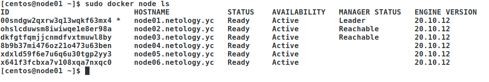

# Домашнее задание к занятию "5.5. Оркестрация кластером Docker контейнеров на примере Docker Swarm"


## Задача 1

Дайте письменые ответы на следующие вопросы:

- В чём отличие режимов работы сервисов в Docker Swarm кластере: replication и global?
- Какой алгоритм выбора лидера используется в Docker Swarm кластере?
- Что такое Overlay Network?  

**Answer**

- **В чём отличие режимов работы сервисов в Docker Swarm кластере: replication и global?**  
replication type обеспечивает запуск заданного количества реплик, размещая их на доступных нодах кластера, а global type обеспечивает запуск по одной реплике на каждой доступной ноде кластера. Работает это примерно также, как ReplicaSet и DaemonSet в Kubernetes.
- **Какой алгоритм выбора лидера используется в Docker Swarm кластере?**  
Raft Consensus Algorithm. В случае неполучения heartbeat сообщения от текущего лидера фолловеры выжидают 150-300ms (election timeout). Если в указанный промежуток времени фолловер не получает приглашение проголосовать за какого-либо кандидата, то он сам объявляет себя кандидатом и рассылает такое приглашение. В случае получения большинства голосов кандидат объявляет себя лидером и периодически рассылает heartbeat сообщения остальным членам.
- **Что такое Overlay Network?**  
Сеть для обмена трафиком между контейнерами, находящимися на разных нодах кластера. Использует технологию VXLAN - инкапсуляцию L2 фреймы в L4 пакеты, что позволяет создавать виртуальные сети поверх физических.


## Задача 2

Создать ваш первый Docker Swarm кластер в Яндекс.Облаке

Для получения зачета, вам необходимо предоставить скриншот из терминала (консоли), с выводом команды:
```
docker node ls
```

**Answer**

    

    [centos@node01 ~]$ sudo docker node ls
    ID                            HOSTNAME             STATUS    AVAILABILITY   MANAGER STATUS   ENGINE VERSION
    00sndgw2qxrw3q13wqkf63mx4 *   node01.netology.yc   Ready     Active         Leader           20.10.12
    ohslcduwsm8iwiwqe1e8er98a     node02.netology.yc   Ready     Active         Reachable        20.10.12
    dkfgtfqmjjcnmdfvxtmuwl8by     node03.netology.yc   Ready     Active         Reachable        20.10.12
    8b9b37mi476oz21o473u63ben     node04.netology.yc   Ready     Active                          20.10.12
    xdxld59f6e7u6q6u30tgp2yy3     node05.netology.yc   Ready     Active                          20.10.12
    x641f3fcbxa7v108xqa7nxqc0     node06.netology.yc   Ready     Active                          20.10.12


## Задача 3

Создать ваш первый, готовый к боевой эксплуатации кластер мониторинга, состоящий из стека микросервисов.

Для получения зачета, вам необходимо предоставить скриншот из терминала (консоли), с выводом команды:
```
docker service ls
```

**Answer**

    3

## Задача 4 (*)

Выполнить на лидере Docker Swarm кластера команду (указанную ниже) и дать письменное описание её функционала, что она делает и зачем она нужна:
```
# см.документацию: https://docs.docker.com/engine/swarm/swarm_manager_locking/
docker swarm update --autolock=true
```

**Answer**

    4