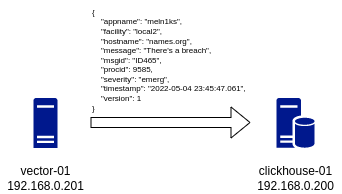

# Домашнее задание к занятию "08.02 Работа с Playbook"

## Подготовка к выполнению

1. Создайте свой собственный (или используйте старый) публичный репозиторий на github с произвольным именем.
2. Скачайте [playbook](./playbook/) из репозитория с домашним заданием и перенесите его в свой репозиторий.
3. Подготовьте хосты в соответствии с группами из предподготовленного playbook.

<details>
<summary>Задание</summary>
## Основная часть

1. Приготовьте свой собственный inventory файл `prod.yml`.
2. Допишите playbook: нужно сделать ещё один play, который устанавливает и настраивает [vector](https://vector.dev).
3. При создании tasks рекомендую использовать модули: `get_url`, `template`, `unarchive`, `file`.
4. Tasks должны: скачать нужной версии дистрибутив, выполнить распаковку в выбранную директорию, установить vector.
5. Запустите `ansible-lint site.yml` и исправьте ошибки, если они есть.
6. Попробуйте запустить playbook на этом окружении с флагом `--check`.
7. Запустите playbook на `prod.yml` окружении с флагом `--diff`. Убедитесь, что изменения на системе произведены.
8. Повторно запустите playbook с флагом `--diff` и убедитесь, что playbook идемпотентен.
9. Подготовьте README.md файл по своему playbook. В нём должно быть описано: что делает playbook, какие у него есть параметры и теги.
10. Готовый playbook выложите в свой репозиторий, поставьте тег `08-ansible-02-playbook` на фиксирующий коммит, в ответ предоставьте ссылку на него.
</details>


**Answers**


**[playbook location](assets/playbook/)**

## Инфраструктура:



1. Сервер `clickhouse-01` для сбора логов.
2. Сервер `vector-01`, генерирующий и обрабатывающий логи.

Приложение на сервере `vector-01` генерирует псевдо логи и отсылает их на сервер `clickhouse-01` для сохранения в базу данных.

## Playbook

Playbook производит установку и настройку следующих приложений на указанных серверах.


- ### Clickhouse

  - установка `clickhouse`
  - настройка удаленных подключений к приложению
  - создание базы данных и таблицы в ней


- ### Vector

  - установка `vector`
  - изменение конфига приложения для отправки логов на сервер `clickhouse-01`


## Variables

Через group_vars можно задать следующие параметры:
- `clickhouse_version`, `vector_version` - версии устанавливаемых приложений;
- `clickhouse_database_name` - имя базы данных для хранения логов;
- `clickhouse_create_table` - структуру таблицы для хранения логов;
- `vector_config` - содержимое конфигурационного файла для приложения `vector`;

## Tags

- `clickhouse` производит полную конфигурацию сервера `clickhouse-01`;
- `clickhouse_db` производит конфигурацию базы данных и таблицы;
- `vector` производит полную конфигурацию сервера `vector-01`;
- `vector_config` производит изменение в конфиге приложения `vector`;
- `drop_clickhouse_database_logs` удаляет базу данных (по умолчанию не выполняется);

---

- Для изменения конфигурации `vector` достаточно использовать тэг `vector_config`

    ```console
    ansible-playbook -i inventory/prod.yml site.yml --tags vector_config
    ```

- для создания новой базы данных и записи логов в нее необходимо использовать тэги `clickhouse_db` и `vector_config`

    ```console
    ansible-playbook -i inventory/prod.yml site.yml --tags clickhouse_db --tags vector_config
    ```

- если требуется пересоздать существующую базу данных, то можно использовать тэги `drop_clickhouse_database_logs` и `clickhouse_db`
- 
    ```console
    ansible-playbook -i inventory/prod.yml site.yml --tags drop_clickhouse_database_logs --tags clickhouse_db
    ```
Для полной установки инфраструктуры указывать тэги не требуется.