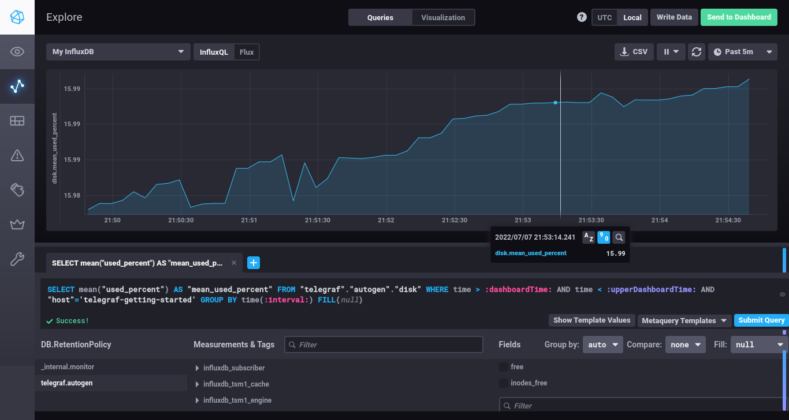

# Домашнее задание к занятию "10.02. Системы мониторинга"

## Обязательные задания

1. Опишите основные плюсы и минусы pull и push систем мониторинга.

**Answer**


__push model__:

  __плюсы__:
  - не требует открытия входящих портов на агентах;
  - можно обеспечить высокую сетевую производительность, используя udp;
  - гибкая настройка агентов в части обмена трафиком.

  __минусы__:
  - полное отсутствие информации о состоянии агента, если он не присылает метрики;
  - сложнее контролировать подлинность данных;

__pull model__:

  __плюсы__:
  - есть возможность централизованно выбирать агенты, с которых требуется собирать метрики;
  - простой протокол сбора метрик, легко повторить вручную при дебаге;

  __минусы__:
  - требуется дополнительный механизм обновления списка объектов мониторинга (discovery);
  - необходимо открывать входящие порты на объектах мониторинга;
  - плохо ложится на событийную модель сбора метрик, например, для сбора результатов исполнения каких-то разовых задач;
---

2. Какие из ниже перечисленных систем относятся к push модели, а какие к pull? А может есть гибридные?

**Answer**

  - __Prometheus__: основным является pull; push лимитирован, требуется pushgateway
  - __TICK__: push или pull в зависимости от возможностей input плагина;
  - __Zabbix__: push или pull;
  - __VictoriaMetrics__: основным является pull через vmagent, но есть и возможность push с использованием remote write;
  - __Nagios__: основной pull и дополнительный push в зависимости от агента;

---

3. Склонируйте себе [репозиторий](https://github.com/influxdata/sandbox/tree/master) и запустите TICK-стэк, 
используя технологии docker и docker-compose.

В виде решения на это упражнение приведите выводы команд с вашего компьютера (виртуальной машины):

    - curl http://localhost:8086/ping
    - curl http://localhost:8888
    - curl http://localhost:9092/kapacitor/v1/ping

А также скриншот веб-интерфейса ПО chronograf (`http://localhost:8888`). 

P.S.: если при запуске некоторые контейнеры будут падать с ошибкой - проставьте им режим `Z`, например
`./data:/var/lib:Z`

**Answer**

```console
vagrant@vagrant> curl http://localhost:8086/ping?verbose=true
{"version":"1.8.10"}

vagrant@vagrant> curl http://localhost:8888
<!DOCTYPE html><html><head><meta http-equiv="Content-type" content="text/html; charset=utf-8"><title>Chronograf</title><link rel="icon shortcut" href="/favicon.fa749080.ico"><link rel="stylesheet" href="/src.9cea3e4e.css"></head><body> <div id="react-root" data-basepath=""></div> <script src="/src.a969287c.js"></script> </body></html>

vagrant@vagrant> curl -v http://localhost:9092/kapacitor/v1/ping
*   Trying 127.0.0.1:9092...
* Connected to localhost (127.0.0.1) port 9092 (#0)
> GET /kapacitor/v1/ping HTTP/1.1
> Host: localhost:9092
> User-Agent: curl/7.78.0
> Accept: */*
> 
* Mark bundle as not supporting multiuse
< HTTP/1.1 204 No Content
< Content-Type: application/json; charset=utf-8
< Request-Id: 49cfadca-fe23-11ec-8097-000000000000
< X-Kapacitor-Version: 1.6.4
< Date: Thu, 07 Jul 2022 18:33:25 GMT
< 
* Connection #0 to host localhost left intact

```


---

4. Перейдите в веб-интерфейс Chronograf (`http://localhost:8888`) и откройте вкладку `Data explorer`.

    - Нажмите на кнопку `Add a query`
    - Изучите вывод интерфейса и выберите БД `telegraf.autogen`
    - В `measurments` выберите mem->host->telegraf_container_id , а в `fields` выберите used_percent. 
    Внизу появится график утилизации оперативной памяти в контейнере telegraf.
    - Вверху вы можете увидеть запрос, аналогичный SQL-синтаксису. 
    Поэкспериментируйте с запросом, попробуйте изменить группировку и интервал наблюдений.

Для выполнения задания приведите скриншот с отображением метрик утилизации места на диске 
(disk->host->telegraf_container_id) из веб-интерфейса.

**Answer**



---

5. Изучите список [telegraf inputs](https://github.com/influxdata/telegraf/tree/master/plugins/inputs). 
Добавьте в конфигурацию telegraf следующий плагин - [docker](https://github.com/influxdata/telegraf/tree/master/plugins/inputs/docker):
```
[[inputs.docker]]
  endpoint = "unix:///var/run/docker.sock"
```

Дополнительно вам может потребоваться донастройка контейнера telegraf в `docker-compose.yml` дополнительного volume и 
режима privileged:
```
  telegraf:
    image: telegraf:1.4.0
    privileged: true
    volumes:
      - ./etc/telegraf.conf:/etc/telegraf/telegraf.conf:Z
      - /var/run/docker.sock:/var/run/docker.sock:Z
    links:
      - influxdb
    ports:
      - "8092:8092/udp"
      - "8094:8094"
      - "8125:8125/udp"
```

После настройке перезапустите telegraf, обновите веб интерфейс и приведите скриншотом список `measurments` в 
веб-интерфейсе базы telegraf.autogen . Там должны появиться метрики, связанные с docker.

Факультативно можете изучить какие метрики собирает telegraf после выполнения данного задания.

**Answer**


---