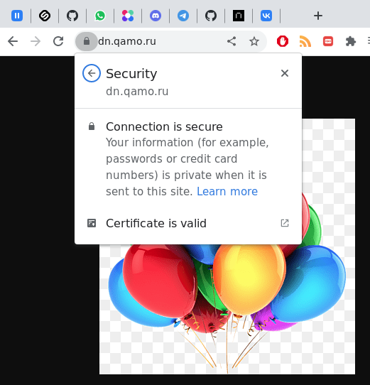

# Домашнее задание к занятию 15.3 "Безопасность в облачных провайдерах"
Используя конфигурации, выполненные в рамках предыдущих домашних заданиях, нужно добавить возможность шифрования бакета.

---
## Задание 1. Яндекс.Облако (обязательное к выполнению)
1. С помощью ключа в KMS необходимо зашифровать содержимое бакета:
- Создать ключ в KMS,
- С помощью ключа зашифровать содержимое бакета, созданного ранее.

**Answer**

Модуль из предыдущего задания изменен таким образом, чтобы включать или отключать шифрование бакета с помощью переменной `enable_encryption`.

- [KMS terraform module](assets/modules/kms/)

```console
% terraform state show 'module.buckets.yandex_storage_bucket.hosting'
# module.buckets.yandex_storage_bucket.hosting:
resource "yandex_storage_bucket" "hosting" {
    acl                   = "public-read"
    bucket                = "dn.qamo.ru"
    bucket_domain_name    = "dn.qamo.ru.storage.yandexcloud.net"
    default_storage_class = "STANDARD"
    folder_id             = "b1g6u4arv1a14pjelfub"
    force_destroy         = false
    id                    = "dn.qamo.ru"
    max_size              = 0
    website_domain        = "website.yandexcloud.net"
    website_endpoint      = "dn.qamo.ru.website.yandexcloud.net"

    anonymous_access_flags {
        list = true
        read = true
    }

    https {
        certificate_id = "fpqhfeajimcc77ugpsd8"
    }

    server_side_encryption_configuration {
        rule {
            apply_server_side_encryption_by_default {
                kms_master_key_id = "abj8ogtm6q973bg04aaa"
                sse_algorithm     = "aws:kms"
            }
        }
    }

    versioning {
        enabled = false
    }

    website {
        error_document = "error.html"
        index_document = "picture.png"
    }
}
```

--- 

1. (Выполняется НЕ в terraform) *Создать статический сайт в Object Storage c собственным публичным адресом и сделать доступным по HTTPS
- Создать сертификат,
- Создать статическую страницу в Object Storage и применить сертификат HTTPS,
- В качестве результата предоставить скриншот на страницу с сертификатом в заголовке ("замочек").

**Answer**

Настройка HTTPS выполняется с помощью модуля terraform, работающего с Yandex Cloud Certificate Manager. Certificate Manager запрашивает сертификат Let's Encrypt для домена `dn.qamo.ru`. В DNS зоне домена прописана CNAME запись для редиректа адреса `dn.qamo.ru` на адрес бакета `dn.qamo.ru.website.yandexcloud.net.`, и добавлена TXT запись для проверки DNS Challenge.

- [certificates module](assets/modules/certificates/)



Проверка сертификатов

```console

% openssl s_client -connect dn.qamo.ru:443 -showcerts 2>&1 < /dev/null
CONNECTED(00000003)
depth=2 C = US, O = Internet Security Research Group, CN = ISRG Root X1
verify return:1
depth=1 C = US, O = Let's Encrypt, CN = R3
verify return:1
depth=0 CN = dn.qamo.ru
verify return:1
---
Certificate chain
 0 s:CN = dn.qamo.ru
   i:C = US, O = Let's Encrypt, CN = R3
-----BEGIN CERTIFICATE-----
MIIFGzCCBAOgAwIBAgISBDiHFl4dI4DyIAKGVrlclELGMA0GCSqGSIb3DQEBCwUA
MDIxCzAJBgNVBAYTAlVTMRYwFAYDVQQKEw1MZXQncyBFbmNyeXB0MQswCQYDVQQD
EwJSMzAeFw0yMjEyMTkxNzIzMTdaFw0yMzAzMTkxNzIzMTZaMBUxEzARBgNVBAMT
CmRuLnFhbW8ucnUwggEiMA0GCSqGSIb3DQEBAQUAA4IBDwAwggEKAoIBAQChKhkp
8D/TXawIiIKfjb77DPVdGkjQ1Fms4CPmRGQpDM7XDgr+cwNrjlk76OQpi+d5bnS6
ALy/L41FXcsDtk1SJkOV2LSnHtvpJ3TP7LjdWJgXjbtO3GfH86iozBkIS6xcHeWN
RNN7rwKlA3O66c0ZEaIEdqtspXB9BKfAKTgaiHXXWhuJToIQHD+0xj2q0qKNXdx2
aSpcHthtXnAFHxoG0KxJkE4zu1ntGAEg+MW7+dJy6fRPA+BXbnKlqdThR29bXI9C
8k4zEoZhD3Fne02yzTJwSCdpYCiu+xX5hNkfjnJhajkw/pmtcZt6lMhhnQ4GHE3c
XLUWxXoW8ex1mabxAgMBAAGjggJGMIICQjAOBgNVHQ8BAf8EBAMCBaAwHQYDVR0l
BBYwFAYIKwYBBQUHAwEGCCsGAQUFBwMCMAwGA1UdEwEB/wQCMAAwHQYDVR0OBBYE
FBwcz+ddUblgIrmpppwC+BuIjqipMB8GA1UdIwQYMBaAFBQusxe3WFbLrlAJQOYf
r52LFMLGMFUGCCsGAQUFBwEBBEkwRzAhBggrBgEFBQcwAYYVaHR0cDovL3IzLm8u
bGVuY3Iub3JnMCIGCCsGAQUFBzAChhZodHRwOi8vcjMuaS5sZW5jci5vcmcvMBUG
A1UdEQQOMAyCCmRuLnFhbW8ucnUwTAYDVR0gBEUwQzAIBgZngQwBAgEwNwYLKwYB
BAGC3xMBAQEwKDAmBggrBgEFBQcCARYaaHR0cDovL2Nwcy5sZXRzZW5jcnlwdC5v
cmcwggEFBgorBgEEAdZ5AgQCBIH2BIHzAPEAdgB6MoxU2LcttiDqOOBSHumEFnAy
E4VNO9IrwTpXo1LrUgAAAYUroDaSAAAEAwBHMEUCIA+JHlo4QtZNgq4y2MhbddBQ
5VAMcC7ARfvnTzxMf0oYAiEArytDRJAuQH/1iFYoyO9rVg5wmp3OTUGThsg/vfWQ
CBMAdwDoPtDaPvUGNTLnVyi8iWvJA9PL0RFr7Otp4Xd9bQa9bgAAAYUroDhyAAAE
AwBIMEYCIQCPI1FyERk2dIdx/GeT7OB5CtZv6LCkdWpWUGqEyohjoQIhAPWjjYns
ETiikE+xseTn1G4Zq6/wGgVJ3HFhHmxJIdp+MA0GCSqGSIb3DQEBCwUAA4IBAQCV
rf2GWa2teh3cfiIQMwsD2/1hflNjuJKl6eGjj3mmFRmZZuwh/54NQeZcKVlr2Ugv
oQwUmbK5E+ajujs7zkSttGLbwIeLNtNd4zjhEgOMi/3xU8co/Vkk52Y0MQofObXF
RhMZ0bytxcIAA2SLbFf5eVWiphjNkPECxQrJwVIiEKXdHMqr9bys1F0EqveqbIJx
jKjvQqLsU+ODQ1D7m+IKyxY9ijT+LYNcldiUR47gI1sNGXRJkxYATJ1HvsuhJn5o
EDreusfhr2+ClEE5yPOloIo9cDQldLGtDaYA9yC45zEAjSaBwofA/uWfEkwx2kdO
PWvCwk/TVsO5NzmNhUgb
-----END CERTIFICATE-----
 1 s:C = US, O = Let's Encrypt, CN = R3
   i:C = US, O = Internet Security Research Group, CN = ISRG Root X1
-----BEGIN CERTIFICATE-----
MIIFFjCCAv6gAwIBAgIRAJErCErPDBinU/bWLiWnX1owDQYJKoZIhvcNAQELBQAw
TzELMAkGA1UEBhMCVVMxKTAnBgNVBAoTIEludGVybmV0IFNlY3VyaXR5IFJlc2Vh
cmNoIEdyb3VwMRUwEwYDVQQDEwxJU1JHIFJvb3QgWDEwHhcNMjAwOTA0MDAwMDAw
WhcNMjUwOTE1MTYwMDAwWjAyMQswCQYDVQQGEwJVUzEWMBQGA1UEChMNTGV0J3Mg
RW5jcnlwdDELMAkGA1UEAxMCUjMwggEiMA0GCSqGSIb3DQEBAQUAA4IBDwAwggEK
AoIBAQC7AhUozPaglNMPEuyNVZLD+ILxmaZ6QoinXSaqtSu5xUyxr45r+XXIo9cP
R5QUVTVXjJ6oojkZ9YI8QqlObvU7wy7bjcCwXPNZOOftz2nwWgsbvsCUJCWH+jdx
sxPnHKzhm+/b5DtFUkWWqcFTzjTIUu61ru2P3mBw4qVUq7ZtDpelQDRrK9O8Zutm
NHz6a4uPVymZ+DAXXbpyb/uBxa3Shlg9F8fnCbvxK/eG3MHacV3URuPMrSXBiLxg
Z3Vms/EY96Jc5lP/Ooi2R6X/ExjqmAl3P51T+c8B5fWmcBcUr2Ok/5mzk53cU6cG
/kiFHaFpriV1uxPMUgP17VGhi9sVAgMBAAGjggEIMIIBBDAOBgNVHQ8BAf8EBAMC
AYYwHQYDVR0lBBYwFAYIKwYBBQUHAwIGCCsGAQUFBwMBMBIGA1UdEwEB/wQIMAYB
Af8CAQAwHQYDVR0OBBYEFBQusxe3WFbLrlAJQOYfr52LFMLGMB8GA1UdIwQYMBaA
FHm0WeZ7tuXkAXOACIjIGlj26ZtuMDIGCCsGAQUFBwEBBCYwJDAiBggrBgEFBQcw
AoYWaHR0cDovL3gxLmkubGVuY3Iub3JnLzAnBgNVHR8EIDAeMBygGqAYhhZodHRw
Oi8veDEuYy5sZW5jci5vcmcvMCIGA1UdIAQbMBkwCAYGZ4EMAQIBMA0GCysGAQQB
gt8TAQEBMA0GCSqGSIb3DQEBCwUAA4ICAQCFyk5HPqP3hUSFvNVneLKYY611TR6W
PTNlclQtgaDqw+34IL9fzLdwALduO/ZelN7kIJ+m74uyA+eitRY8kc607TkC53wl
ikfmZW4/RvTZ8M6UK+5UzhK8jCdLuMGYL6KvzXGRSgi3yLgjewQtCPkIVz6D2QQz
CkcheAmCJ8MqyJu5zlzyZMjAvnnAT45tRAxekrsu94sQ4egdRCnbWSDtY7kh+BIm
lJNXoB1lBMEKIq4QDUOXoRgffuDghje1WrG9ML+Hbisq/yFOGwXD9RiX8F6sw6W4
avAuvDszue5L3sz85K+EC4Y/wFVDNvZo4TYXao6Z0f+lQKc0t8DQYzk1OXVu8rp2
yJMC6alLbBfODALZvYH7n7do1AZls4I9d1P4jnkDrQoxB3UqQ9hVl3LEKQ73xF1O
yK5GhDDX8oVfGKF5u+decIsH4YaTw7mP3GFxJSqv3+0lUFJoi5Lc5da149p90Ids
hCExroL1+7mryIkXPeFM5TgO9r0rvZaBFOvV2z0gp35Z0+L4WPlbuEjN/lxPFin+
HlUjr8gRsI3qfJOQFy/9rKIJR0Y/8Omwt/8oTWgy1mdeHmmjk7j1nYsvC9JSQ6Zv
MldlTTKB3zhThV1+XWYp6rjd5JW1zbVWEkLNxE7GJThEUG3szgBVGP7pSWTUTsqX
nLRbwHOoq7hHwg==
-----END CERTIFICATE-----
 2 s:C = US, O = Internet Security Research Group, CN = ISRG Root X1
   i:O = Digital Signature Trust Co., CN = DST Root CA X3
-----BEGIN CERTIFICATE-----
MIIFYDCCBEigAwIBAgIQQAF3ITfU6UK47naqPGQKtzANBgkqhkiG9w0BAQsFADA/
MSQwIgYDVQQKExtEaWdpdGFsIFNpZ25hdHVyZSBUcnVzdCBDby4xFzAVBgNVBAMT
DkRTVCBSb290IENBIFgzMB4XDTIxMDEyMDE5MTQwM1oXDTI0MDkzMDE4MTQwM1ow
TzELMAkGA1UEBhMCVVMxKTAnBgNVBAoTIEludGVybmV0IFNlY3VyaXR5IFJlc2Vh
cmNoIEdyb3VwMRUwEwYDVQQDEwxJU1JHIFJvb3QgWDEwggIiMA0GCSqGSIb3DQEB
AQUAA4ICDwAwggIKAoICAQCt6CRz9BQ385ueK1coHIe+3LffOJCMbjzmV6B493XC
ov71am72AE8o295ohmxEk7axY/0UEmu/H9LqMZshftEzPLpI9d1537O4/xLxIZpL
wYqGcWlKZmZsj348cL+tKSIG8+TA5oCu4kuPt5l+lAOf00eXfJlII1PoOK5PCm+D
LtFJV4yAdLbaL9A4jXsDcCEbdfIwPPqPrt3aY6vrFk/CjhFLfs8L6P+1dy70sntK
4EwSJQxwjQMpoOFTJOwT2e4ZvxCzSow/iaNhUd6shweU9GNx7C7ib1uYgeGJXDR5
bHbvO5BieebbpJovJsXQEOEO3tkQjhb7t/eo98flAgeYjzYIlefiN5YNNnWe+w5y
sR2bvAP5SQXYgd0FtCrWQemsAXaVCg/Y39W9Eh81LygXbNKYwagJZHduRze6zqxZ
Xmidf3LWicUGQSk+WT7dJvUkyRGnWqNMQB9GoZm1pzpRboY7nn1ypxIFeFntPlF4
FQsDj43QLwWyPntKHEtzBRL8xurgUBN8Q5N0s8p0544fAQjQMNRbcTa0B7rBMDBc
SLeCO5imfWCKoqMpgsy6vYMEG6KDA0Gh1gXxG8K28Kh8hjtGqEgqiNx2mna/H2ql
PRmP6zjzZN7IKw0KKP/32+IVQtQi0Cdd4Xn+GOdwiK1O5tmLOsbdJ1Fu/7xk9TND
TwIDAQABo4IBRjCCAUIwDwYDVR0TAQH/BAUwAwEB/zAOBgNVHQ8BAf8EBAMCAQYw
SwYIKwYBBQUHAQEEPzA9MDsGCCsGAQUFBzAChi9odHRwOi8vYXBwcy5pZGVudHJ1
c3QuY29tL3Jvb3RzL2RzdHJvb3RjYXgzLnA3YzAfBgNVHSMEGDAWgBTEp7Gkeyxx
+tvhS5B1/8QVYIWJEDBUBgNVHSAETTBLMAgGBmeBDAECATA/BgsrBgEEAYLfEwEB
ATAwMC4GCCsGAQUFBwIBFiJodHRwOi8vY3BzLnJvb3QteDEubGV0c2VuY3J5cHQu
b3JnMDwGA1UdHwQ1MDMwMaAvoC2GK2h0dHA6Ly9jcmwuaWRlbnRydXN0LmNvbS9E
U1RST09UQ0FYM0NSTC5jcmwwHQYDVR0OBBYEFHm0WeZ7tuXkAXOACIjIGlj26Ztu
MA0GCSqGSIb3DQEBCwUAA4IBAQAKcwBslm7/DlLQrt2M51oGrS+o44+/yQoDFVDC
5WxCu2+b9LRPwkSICHXM6webFGJueN7sJ7o5XPWioW5WlHAQU7G75K/QosMrAdSW
9MUgNTP52GE24HGNtLi1qoJFlcDyqSMo59ahy2cI2qBDLKobkx/J3vWraV0T9VuG
WCLKTVXkcGdtwlfFRjlBz4pYg1htmf5X6DYO8A4jqv2Il9DjXA6USbW1FzXSLr9O
he8Y4IWS6wY7bCkjCWDcRQJMEhg76fsO3txE+FiYruq9RUWhiF1myv4Q6W+CyBFC
Dfvp7OOGAN6dEOM4+qR9sdjoSYKEBpsr6GtPAQw4dy753ec5
-----END CERTIFICATE-----
---
Server certificate
subject=CN = dn.qamo.ru

issuer=C = US, O = Let's Encrypt, CN = R3

---
No client certificate CA names sent
Peer signing digest: SHA256
Peer signature type: RSA-PSS
Server Temp Key: X25519, 253 bits
---
SSL handshake has read 4567 bytes and written 392 bytes
Verification: OK
---
New, TLSv1.3, Cipher is TLS_AES_256_GCM_SHA384
Server public key is 2048 bit
Secure Renegotiation IS NOT supported
Compression: NONE
Expansion: NONE
No ALPN negotiated
Early data was not sent
Verify return code: 0 (ok)
---
DONE


```

--- 

Документация
- [Настройка HTTPS статичного сайта](https://cloud.yandex.ru/docs/storage/operations/hosting/certificate)
- [Object storage bucket](https://registry.terraform.io/providers/yandex-cloud/yandex/latest/docs/resources/storage_bucket)
- [KMS key](https://registry.terraform.io/providers/yandex-cloud/yandex/latest/docs/resources/kms_symmetric_key)


<details>
<summary>Задание 2*. AWS (необязательное к выполнению)</summary>
## Задание 2*. AWS (необязательное к выполнению)

1. С помощью роли IAM записать файлы ЕС2 в S3-бакет:
- Создать роль в IAM для возможности записи в S3 бакет;
- Применить роль к ЕС2-инстансу;
- С помощью бутстрап скрипта записать в бакет файл web-страницы.
2. Организация шифрования содержимого S3-бакета:
- Используя конфигурации, выполненные в рамках ДЗ на предыдущем занятии, добавить к созданному ранее bucket S3 возможность шифрования Server-Side, используя общий ключ;
- Включить шифрование SSE-S3 bucket S3 для шифрования всех вновь добавляемых объектов в данный bucket.
3. *Создание сертификата SSL и применение его к ALB:
- Создать сертификат с подтверждением по email;
- Сделать запись в Route53 на собственный поддомен, указав адрес LB;
- Применить к HTTPS запросам на LB созданный ранее сертификат.

Resource terraform
- [IAM Role](https://registry.terraform.io/providers/hashicorp/aws/latest/docs/resources/iam_role)
- [AWS KMS](https://registry.terraform.io/providers/hashicorp/aws/latest/docs/resources/kms_key)
- [S3 encrypt with KMS key](https://registry.terraform.io/providers/hashicorp/aws/latest/docs/resources/s3_bucket_object#encrypting-with-kms-key)

Пример bootstrap-скрипта:
```
#!/bin/bash
yum install httpd -y
service httpd start
chkconfig httpd on
cd /var/www/html
echo "<html><h1>My cool web-server</h1></html>" > index.html
aws s3 mb s3://mysuperbacketname2021
aws s3 cp index.html s3://mysuperbacketname2021
```

</details>