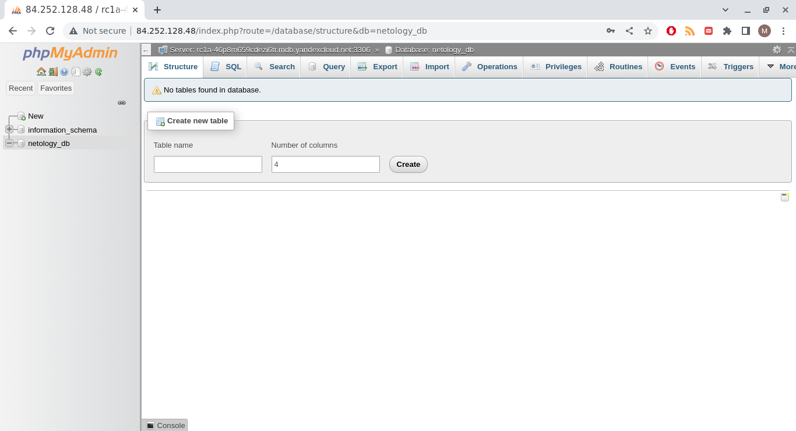

# Домашнее задание к занятию 15.4 "Кластеры. Ресурсы под управлением облачных провайдеров"

Организация кластера Kubernetes и кластера баз данных MySQL в отказоустойчивой архитектуре.
Размещение в private подсетях кластера БД, а в public - кластера Kubernetes.

---
## Задание 1. Яндекс.Облако (обязательное к выполнению)

1. Настроить с помощью Terraform кластер баз данных MySQL:
- Используя настройки VPC с предыдущих ДЗ, добавить дополнительно подсеть private в разных зонах, чтобы обеспечить отказоустойчивость 
- Разместить ноды кластера MySQL в разных подсетях
- Необходимо предусмотреть репликацию с произвольным временем технического обслуживания
- Использовать окружение PRESTABLE, платформу Intel Broadwell с производительностью 50% CPU и размером диска 20 Гб
- Задать время начала резервного копирования - 23:59
- Включить защиту кластера от непреднамеренного удаления
- Создать БД с именем `netology_db` c логином и паролем

**Answer**

Решение разбито на отдельные шаги, реализуемые следующими модулями:

- [networks](assets/modules/networks/) для создания подсетей
- [mysql_cluster](assets/modules/mysql_cluster/) для создания управляемого MySQL кластера
- [mysql_db](assets/modules/mysql_db/) для создания БД в кластере
- [mysql_user](assets/modules/mysql_user/) для создания пользователя

Сеть для размещения подсетей должна быть создана до запуска терраформ.
Вызов всех модулей, необходимых для установки кластера, осуществляется из файла [mysql.tf](assets/mysql.tf). Там же прописаны значения всех переменных.
Учетные данные для доступа к MySQL генерируется рандомно. Их можно найти в `terraform.tfstate` файле после деплоя, либо же получить командой:

```
terraform output username
terraform output password
```

Полный список стейтов (включая и стейты для установки kubernetes кластера)

```
% terraform state list
module.mysql_cluster.yandex_mdb_mysql_cluster.cluster
module.mysql_db.yandex_mdb_mysql_database.db
module.mysql_networks.data.yandex_vpc_network.network
module.mysql_networks.yandex_vpc_subnet.subnet["mysql-subnet-a"]
module.mysql_networks.yandex_vpc_subnet.subnet["mysql-subnet-b"]
module.mysql_user.random_password.password
module.mysql_user.yandex_mdb_mysql_user.user
module.service_account.data.yandex_resourcemanager_folder.current
module.service_account.yandex_iam_service_account.sa
module.service_account.yandex_resourcemanager_folder_iam_binding.binding
```


---

2. Настроить с помощью Terraform кластер Kubernetes
- Используя настройки VPC с предыдущих ДЗ, добавить дополнительно 2 подсети public в разных зонах, чтобы обеспечить отказоустойчивость
- Создать отдельный сервис-аккаунт с необходимыми правами 
- Создать региональный мастер kubernetes с размещением нод в разных 3 подсетях
- Добавить возможность шифрования ключом из KMS, созданного в предыдущем ДЗ
- Создать группу узлов состояющую из 3 машин с автомасштабированием до 6
- Подключиться к кластеру с помощью `kubectl`
- *Запустить микросервис phpmyadmin и подключиться к БД, созданной ранее
- *Создать сервис типы Load Balancer и подключиться к phpmyadmin. Предоставить скриншот с публичным адресом и подключением к БД

**Answer**

Решение разбито на отдельные шаги, реализуемые следующими модулями:

- [networks](assets/modules/networks/) для создания подсетей
- [k8s_cluster](assets/modules/k8s_cluster/) для создания Kubernetes кластера
- [k8s_nodes](assets/modules/k8s_nodes/) для создания Kubernetes Node Group
- [service_account](assets/modules/service_account/) для создания Service Accounts для работы Kubernetes кластера

Сеть, routing table и internet gateway должны быть созданы до запуска terraform.
Вызов всех модулей, необходимых для установки кластера, осуществляется из файла [k8s.tf](assets/k8s.tf). Там же прописаны значения всех переменных.
Из-за ограничений работы с заранее неизвестным динамическим количеством ресурсов требуется сначала создать подсети командой

```
terraform apply -target=module.k8s_networks
```

а потом произвести деплой остальных ресурсов 

```
terrafrom apply
```

Список стейтов

```
% terraform state list
module.k8s_cluster.yandex_kms_symmetric_key.key
module.k8s_cluster.yandex_kubernetes_cluster.cluster
module.k8s_networks.data.yandex_vpc_network.network
module.k8s_networks.data.yandex_vpc_route_table.this[0]
module.k8s_networks.yandex_vpc_subnet.subnet["k8s-subnet-a"]
module.k8s_networks.yandex_vpc_subnet.subnet["k8s-subnet-b"]
module.k8s_networks.yandex_vpc_subnet.subnet["k8s-subnet-c"]
module.k8s_nodes["b0cu5t10d41qd0c76s04"].yandex_kubernetes_node_group.ng
module.k8s_nodes["e2l65nlfkrnneljkjhra"].yandex_kubernetes_node_group.ng
module.k8s_nodes["e9bj1katgqib3h7cbh86"].yandex_kubernetes_node_group.ng
```

После установки копируем kubeconfig

```
yc managed-kubernetes cluster \
   --cloud-id ${YC_CLOUD_ID} \
   --folder-id ${YC_FOLDER_ID} \
  get-credentials k8s-cluster \
  --external \
  --force
```
Производим деплой helm чарта [bitnami/phpmyadmin](https://artifacthub.io/packages/helm/bitnami/phpmyadmin)

```
helm repo add bitnami https://charts.bitnami.com/bitnami
helm install phpmyadmin bitnami/phpmyadmin --set db.host=rc1a-46p8m659cdezi6tr.mdb.yandexcloud.net
```

Деплоим Service типа LoadBalancer 

```
kubectl apply -f assets/load-balancer.yml
```

Смотрим endpoint сервиса

```
% kubectl get service/phpmyadmin
NAME         TYPE           CLUSTER-IP      EXTERNAL-IP     PORT(S)                      AGE
phpmyadmin   LoadBalancer   10.96.223.198   84.252.128.48   80:32526/TCP,443:31151/TCP   24m
```

Смотрим логин и сгенерированный пароль к БД

```
% terraform output username
"netology_db"
% terraform output password
">sxt4(14s7iwE9?7"
```

Открываем страницу и логинимся




---

Документация
- [MySQL cluster](https://registry.terraform.io/providers/yandex-cloud/yandex/latest/docs/resources/mdb_mysql_cluster)
- [Создание кластера kubernetes](https://cloud.yandex.ru/docs/managed-kubernetes/operations/kubernetes-cluster/kubernetes-cluster-create)
- [K8S Cluster](https://registry.terraform.io/providers/yandex-cloud/yandex/latest/docs/resources/kubernetes_cluster)
- [K8S node group](https://registry.terraform.io/providers/yandex-cloud/yandex/latest/docs/resources/kubernetes_node_group)

--- 

<details>
<summary>Задание 2. Вариант с AWS (необязательное к выполнению)</summary>

## Задание 2. Вариант с AWS (необязательное к выполнению)

1. Настроить с помощью terraform кластер EKS в 3 AZ региона, а также RDS на базе MySQL с поддержкой MultiAZ для репликации и создать 2 readreplica для работы:
- Создать кластер RDS на базе MySQL
- Разместить в Private subnet и обеспечить доступ из public-сети c помощью security-group
- Настроить backup в 7 дней и MultiAZ для обеспечения отказоустойчивости
- Настроить Read prelica в кол-ве 2 шт на 2 AZ.

2. Создать кластер EKS на базе EC2:
- С помощью terraform установить кластер EKS на 3 EC2-инстансах в VPC в public-сети
- Обеспечить доступ до БД RDS в private-сети
- С помощью kubectl установить и запустить контейнер с phpmyadmin (образ взять из docker hub) и проверить подключение к БД RDS
- Подключить ELB (на выбор) к приложению, предоставить скрин

Документация
- [Модуль EKS](https://learn.hashicorp.com/tutorials/terraform/eks)

</details>